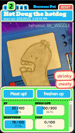

# Overview

A somewhat light-weight way to make a little virtual friend that lives in a browser tab or chrome extension.


**_Built with typescript and React_**

This is based of an earlier project I made, which was a little more complicated, messy, and uses Phaser3 and other stuff: [tly-virtualpet](https://github.com/thyancey/tly-virtualpet)



---
## How does it work?
Everything about the pet is parameterized to support user-generated content:
- The name, biography, scene, and other info for the pet
- The individual stats, their max values, how fast they change over time, and their effects on the pet
- Different statuses and behaviors the pet can have, how it chooses between them, and how they alter the pet's image and other assets in the UI
- Which buttons to show in the UI, what their affects are, and how long the cooldown period is

The pets are designed to change over time, even when the webpage/extension is closed. By saving "last saved" info to localStorage, and using timestamps to calculate the value of stats, the application gives the appearance of always in the background.

At the moment, only the last active pet's stats change over time in the background. This might be changed in the future.


---
# Setup
### install dependencies
```
npm
```
### run the local server on port 3000
```
npm start
```
### build the chrome extension
Creates an untracked /build/ folder, which can be deployed as either a chrome extension or a static website
```
npm build
```
### (when forked) deploy to github pages (via gh-pages plugin)
This will make a build and push it to a /gh-pages branch
```
npm deploy
```

---
# Required data files
## manifest file
At the moment, a manifest file at "/assets/pet-manifest.json" manages which pets are available.
- `id` _string_
  - must be unique among pets, and must currently match id in [Pet Definition](#pet-definition)
- `baseUrl` (string, url)
  - should point to a pet package
    - relative urls are relative to the /public/ folder in this repo/deployed github page
    - explicit external urls are allowed, assuming CORS is supported
- The order of this array currently determines the order of the tabs displayed
```
{
  "pets":[
    { "id": "bunchie", "baseUrl": "assets/pets/bunchie" },
    { "id": "hotdoug", "baseUrl": "https://thyancey.github.io/browserpet-library/pets/hotdoug" },
  ]
} 
```
## pet package
Each pet package is just a directory containing a [Pet Definition](#pet-definition) `data.json` in the format below, as well as any assets located in a relative /assets/ folder.

Some pet examples are remotely hosted at https://thyancey.github.io/browserpet-library/ via githubpages from [this repo](https://github.com/thyancey/browserpet-library)

---
# Pet Definition
A pet definition describes everything about what a pet is and how it behaves. It is not used to store current state. Most of the information is stored within the `logic` object of the json file. See more examples at [this repo](https://github.com/thyancey/browserpet-library)

Spec
- `id`: _string_
  - (soon to be removed) must match `id` in the [manifest file](#manifest-file)
- `name`: _string_
  - Name that displays in the UI
- `bio`: _string_
  - A long biography description of the pet
- `logic` (pet logic object): 
  - information that dictates how the pet functions. See more info in the section below
- (optional) `backgroundColor`: (string, supported css color hex or name format)
- (optional) `backgroundImage`: (string, image url)
  - url to use as the background image, can be relative or explicit

**_backgroundColor and backgroundImage cannot be used at the same time_**

```
{
  "id": "bunchie", // will be removed soon, currently must match id in manifest file
  "name": "Display Name of the Pet",
  "bio": "a long biography description of the pet",
  "backgroundColor": "#343b44",
  "backgroundImage": "assets/bg.jpg",
  "logic": {
    "stats": [],
    "statuses": [],
    "behaviorRules": [],
    "behaviors" : [],
    "interactions": [],
  }
}
```

## Stats
Stats are the attributes that (may) change over time and dictate what happens to your pet. 
- `id`: _string_
  - must be unique among stats for the current pet
- `label`: _string_
  - what displays in the UI
- `value`: _string_
  - the starting value of the stat, when the pet is first loaded
- `max`:  _number_
  - the maximum value the stat can reach
- `perSecond`: _number_
  - dictates how the stat automatically changes over time.
    - `0` will prevent the stat from changing automatically
    - stats are clamped between `0` and the defined `max`
    - handling negative stats or a min other than `0` is not supported at this time
- `fullIsGood`: _boolean_
  - for example, a "boredom" stat would have `false` for this value, but "food" would probably have `true`
- `statEffects`: _array of [whenthen statements](#when-then-statements)_
    - `when` values use [WhenNumber Comparisons](#whennumber-comparisons) relative to the current stat's value
    - `then` values are what [Status](#statuses) is triggered when true
    - each statment is evaluated in the full list, so [Statuses](#statuses) can stack
```
stats:[
  {
    "id": "food",
    "label": "Food",
    "value": 250.0,
    "perSecond": -10.0,
    "max": 500.0,
    "fullIsGood": true,
    "statEffects":[
      { "when": "<=_0", "then": "STATUS_STARVED" },
      { "when": "<_50%", "then": "STATUS_HUNGRY" },
      { "when": [">_50%", "<= 75%"], "then": "STATUS_FULL" }
    ]
  },
  ...
]
```

## Statuses
A pet can have multiple statuses at once. They are more or less an abstraction of the pet's current `stats`.

For example, you can be "hungry" and "angry" at the same time, but you can display these emotions in different ways. The resulting behavior of "hangry" is handled in [Behavior Rules](#behavior-rules) [Behaviors](#behaviors)
- `id` _string_: 
  - must be unique among statuses for this pet
- (optional) `label`: _string_
  - the message that may display in the UI when a pet has this status
- (optional) `message`: _string_ 
  - (to be implemented)
- (optional) `alertType`: _reserved string of [`"warning"`,`"alert"`,`"reward"`]_
  - meta data about the status for extra styling in the UI, supported:
```
stats:[
  {
    "id": "STATUS_HUNGRY",
    "label": "I'm Hungry!",
    "message": "",
    "alertType": "alert"
  },
  ...
]
```

## Behaviors
A behavior dictates what your pet is _actually doing_. 
- `id`: _string_
  - must be unique among behaviors for this pet
- `image`: _string, image url_ 
  - the visual representation of this behavior. Any valid image format is supported, but _animated gifs_ are best!
- (optional) `position`:  _reserved string of [`"top"`,`"bottom"`,`"left"`,`"right"`]_
  - helps anchor the sprite to a side. otherwise the image centers within the frame
  - for example, if your pet was a robotic floor vacuum, you might want to use `bottom`, and if your pet was a weird water stain on the ceiling, youd want to use `top`
- (optional) `offsetY`: _number_
  - pixel value from the edge, helps to align sprites however you want
```
{ 
  "id": "BE_HANGRY",
  "image": "assets/hangry.gif",
  "position": "bottom",
  "offsetY": -50
},
```

## Behavior Rules
Behavior rules are [When Then Statements](#when-then-statements) evaluated in order and the first valid match will return the `then` [Behavior(s)](#behaviors). So, basically a switch statement. These 
- Your pet should always have _some_ behavior, so make sure to declare a default at the end using a `[]` when statement

**_hint: To get your pet behaving as expected, put more specific or important status checks at the top. 
If you were to put less specific/less important statuses first, like "hungry", it will (undesireably) be chosen before a more complicated "hungry and angry" or "dead" check._**
```
behaviorRules:[
  {
    "when": [ "STATUS_HUNGRY", "STATUS_ANGRY" ], // when "STATUS_HUNGRY" and "STATUS_ANGRY"
    "then": "BE_HANGRY"
  },
  {
    "when": [ "STATUS_ANGRY" ],
    "then": "BE_ANGRY"
  },
  {
    "when":[], // can be used to declare "default"
    "then": "BE_NORMAL"
  }
]
```

## interactions
Interactions declare which things you can do to interact with your pet. They display as buttons within the UI - triggering them directly affects [stats](#stats)... which in turn trigger statuses, and ultimately behaviors
- `id`: _string_
  - must be unique among interactions for this pet
- `label`: _string_
  - label displayed on the UI button
- (optional) `cooldown`: _number_
  - milliseconds the user has to wait before being able to trigger this again, if excluded, interaction has no cooldown
- `changeStats`: _array of stat modifiers_
  - can supply multiple object entries of:
    - `statId`: _stat id_
      - must align with an existing [stat id](#stats)
    - `value`: _number_
      - this is how much the stat will be changed
      - int/float and negatives are supported


```
interactions:[
  {
    "id":"INT_EAT",
    "label": "Eat",
    "cooldown": 3000,
    "changeStats":[
      {
        "statId":"hungry",
        "value": -50.0
      },
      {
        "statId":"poop",
        "value": 20
      }
    ]
  },
  ...
]
```

---
# Some other concepts

## When-Then Statements
Used in several places in the [Pet Definition](#pet-definition), when/then statements add some simple conditional logic

### schema
technically, a when/then consists of two arrays, however in terms of JSON schema, a single value is allowed for either
```
{
  when: [ /* conditions, multiples count as AND statements */ ],
  then: [ /* results, multiples will be randomly selected upon evaluation */ ]
}
```
supported: 
```
{
  when: 'THIS',
  then: 'DO_THAT'
},
{
  when: ['THIS', 'AND_THIS'],
  then: ['DO_THAT', 'OR_THAT']
}
```

### WhenNumber Comparisons
When used under the [stats](#stats) group, `when` blocks use some stat expressions and must follow the syntax below. 
>"{comparison}_{value}{unit}"
* *Note the "_" in between the comparison and value*
* *the percentage unit is optional. Without it, expression will use the raw value instead*


examples:
* "<=_30%"
* "<=_30"
* "<_30"
* ">=_0.1234"

comparison | description
-----------|-------
= | exact number match
< | less than
<= | less than or equal to
\> | greater than
\>= | greater than or equal to


unit | description
-----------|-------
(empty) | use number value
% | use percentages

```
when: ['>_25%', '<=_50%'], // when greater than 25% and less than or equal to 50%
```
```
when: ['=_33'], // when equal to the explicit value of 33
```
using shorthand, these two statements are equivalent
```
when: ['=_33']
when: '=_33'
```


### WhenString Comparisons
When used under the [behaviorRules](#behavior-rules) group, `when` blocks should contain only [status ids](#statuses). A single value is an explicit check, supplying an array requires all [statuses](#statuses) to be present
```
when: ['STATUS_HUNGRY', 'STATUS_HANGRY'] // when "STATUS_HUNGRY" and "STATUS_ANGRY"
```
```
when: ['STATUS_ANGRY'] // when "STATUS_ANGRY"
```
using shorthand, these two statements are equivalent
```
when: ['STATUS_ANGRY']
when: 'STATUS_ANGRY'
```


## Delta Stats
Realtime values of stats ("Delta Stats") are calcuated by comparing the current time to the last time stats were saved. This allows the application to act like it's running in the background, even though it isn't.

At the moment, values changes are simple and linear, so they can be calculated easily using the pseudocode formula below

```javascript
  currentStat = savedValue + (secondsElapsed * statPerSecond);
```

stats are saved on an interval and when certain interactions or events occur

Because of this, the webapp saves/loads from a localStorage entry named `"browserpet"`. The app does not currently use any other forms of login or data storage.


---
# Special Thanks
Thanks to [Artem Diashkin's](https://github.com/nemrosim) craco/typescript/chrome-extension [boilerplate](https://github.com/nemrosim/chrome-react-extension-example) that this was started from. The boilerplate was linked from this Medium article: [How To Create A Google Chrome Extension With React](https://medium.com/javascript-in-plain-english/how-to-create-google-chrome-extension-using-react-js-5c9e343323ff)


